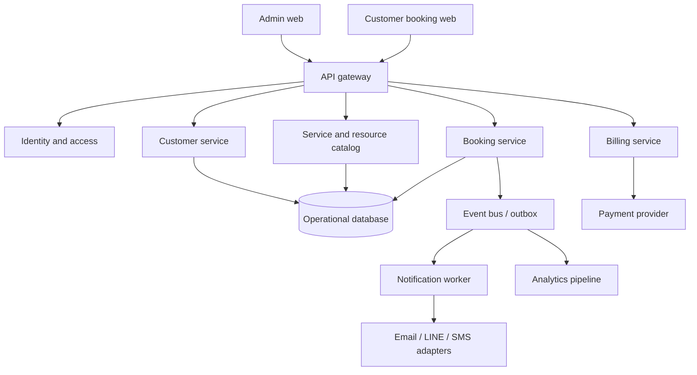

# System Architecture

## Principles
- Modular monolith is acceptable for MVP; preserve domain boundaries.
- Workspace ID scopes every business record.
- Availability calculation has one canonical implementation.
- Writes use idempotency where retries are possible.
- Domain events use an outbox to avoid lost notifications.
- Secrets and provider credentials never enter the design repository.

## Domains
Identity, workspace, catalog, availability, booking, customer, notification, billing, reporting and audit.