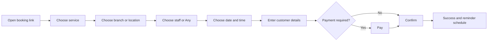

# Booking Flow

## Rules
- Show only bookable combinations after timezone, buffers, capacity, resources, closures and existing appointments are applied.
- Hold a slot only for a configured short period during payment.
- Revalidate availability before confirmation.
- Create an idempotency key for every confirmation attempt.
- Never expose private staff notes.

## Failure handling
Expired slot returns the customer to time selection with retained details. Payment failure does not create a confirmed appointment. Duplicate requests return the existing booking.

## Analytics
`booking_started`, `service_selected`, `slot_selected`, `booking_details_submitted`, `payment_started`, `booking_confirmed`, `booking_failed`.